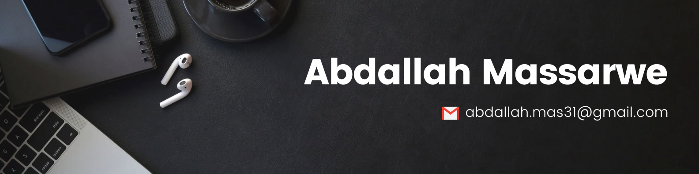

# 👋 Hi, I'm Abdallah

> Aspiring Software Engineer | Full-Stack Developer | AI Enthusiast  

---

---

## 🌟 About Me  
- 🎓 Graduate **BSc Information Systems Focused Artificial Intelligence** 
- 💻 Passionate about building **full-stack web and mobile applications**.  
- 🌱 Currently learning  **React Native**, **Node.js**, and **Firebase**.  
- 🎮 Gamer and tech enthusiast – I enjoy exploring new tools and technologies.

---

## 🛠 Tech Stack  

### Languages:

### Frameworks & Libraries:

### Tools & Platforms:

---

## 🌐 Personal Projects

### 1️⃣ AI Image Generator - Web App  
**Description**: A modern web application that generates images using OpenAI's DALL-E API based on text descriptions.

**Tech Stack**: Javascript, Tailwind CSS, React, OpenAI API
- 📂 [Repository](https://github.com/abdmas31/ai-image-generator) | 📸 [Live Demo](https://ai-image-generator-mocha.vercel.app/)

### 2️⃣ AI Tech Quizz - Web App  
**Description**: An interactive AI-powered educational quiz application for developers to test and improve their technical knowledge across various domains of software development.

**Tech Stack**: Javacript, Tailwind CSS, React ,Firebase Auth, OpenAI API
- 📂 [Repository](https://github.com/abdmas31/ai-tech-quizz) | 📸 [Live Demo](https://ai-tech-quizz.vercel.app/)
---

## 📊 GitHub Stats  

  
  

